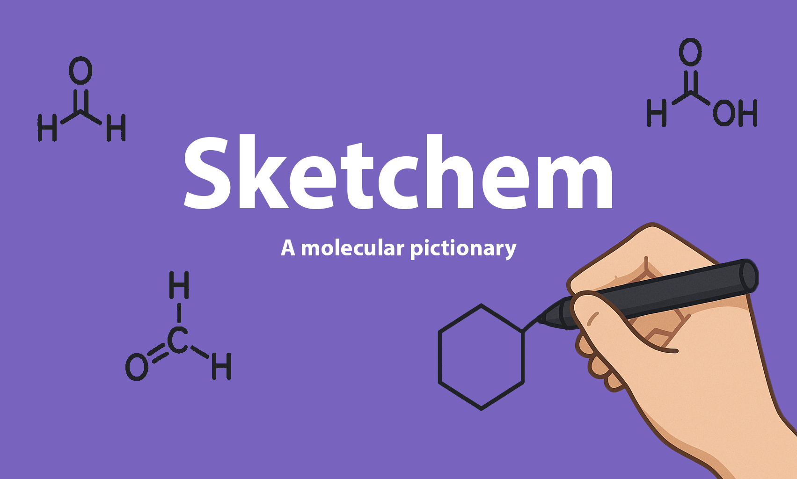

<h1 align="center">
sketchem
</h1>

<br>


A molecular pictionary


## 👩‍💻 Installation

Create a new environment, you may also give the environment a different name.

```
conda create -n sketchem python=3.10
```

```
conda activate sketchem
(conda_env) $ pip install .
```

The DECIMER Canonical model will be automatically downloaded during installation. If you need to manually trigger the model download, you can run:

```bash
sketchem-setup
```


If you need jupyter lab, install it 

```
(sketchem) $ pip install jupyterlab
```


## 🛠️ Development installation


Note: You should have create an empty repository on `https://github.com:axelbrunetta/sketchem`.

```
git init

git add .*

git branch -M main

git push -u origin main
```


To install the package, run

```
(sketchem) $ pip install -e ".[test,doc]"
```

### Run tests and coverage

```
(conda_env) $ pip install tox
(conda_env) $ tox
```


